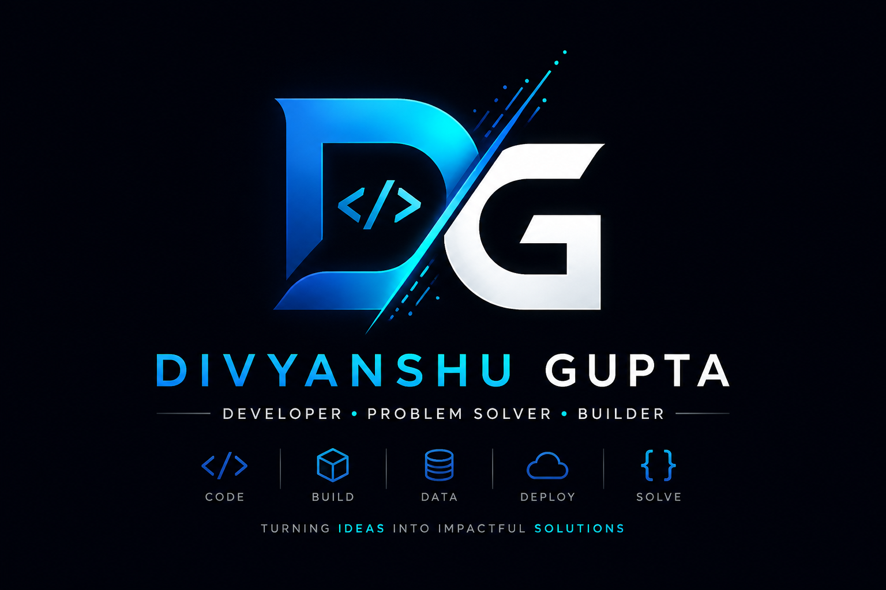

<div align="center">



<br/>

# 👋 Hi, I'm Divyanshu Gupta

### Full-Stack Developer • Backend Enthusiast • Problem Solver

Building things, breaking things, learning how they work — and then building them better. 🚀

</div>

---

## 👨‍💻 About Me

I'm a Computer Science student and developer from India who enjoys turning ideas into **useful, practical software**.

I started with frontend development and gradually moved deeper into the backend — learning how APIs, databases, authentication, architecture, and deployment work together to build complete applications.

* 🔭 Currently focused on **Backend & Full-Stack Development**
* 🌱 Learning **FastAPI, PostgreSQL, REST APIs & scalable backend architecture**
* ⚙️ Interested in **APIs, databases, microservices & cloud deployment**
* 🧠 Enjoy solving programming and real-world problems
* 💡 Always experimenting with new technologies
* 🤝 Open to collaboration, hackathons and interesting ideas

---

## 🛠️ Tech Stack

### 💻 Languages

<p align="left">

</p>

### 🌐 Frontend

<p align="left">

</p>

### ⚡ Backend & Database

<p align="left">

</p>

### ☁️ Tools & Technologies

<p align="left">

</p>

---

## 🧠 Currently Exploring

```text
Backend Development
       ↓
REST API Design
       ↓
Database Architecture
       ↓
Authentication & Security
       ↓
Microservices
       ↓
Docker & Cloud Deployment
       ↓
Scalable Systems
```

---

## ⚡ Development Philosophy

> **Don't just make it work. Understand why it works.**

I believe the best way to learn development is by building, experimenting, debugging, and continuously improving.

```text
Learn → Build → Break → Debug → Improve → Repeat
```

---

## 📊 GitHub Stats

<div align="center">


<br/>


</div>

---

## 📈 My Developer Journey

```text
Frontend
   │
   ├── HTML
   ├── CSS
   ├── JavaScript
   └── Bootstrap
          │
          ▼
Programming
   │
   ├── C++
   └── Python
          │
          ▼
Backend
   │
   ├── PHP
   ├── FastAPI
   ├── REST APIs
   └── Authentication
          │
          ▼
Data
   │
   ├── MySQL
   └── PostgreSQL
          │
          ▼
Infrastructure
   │
   ├── Git & GitHub
   ├── Docker
   ├── Cloudflare
   ├── AWS
   └── Cloud Deployment
```

---

## 🤝 Let's Connect

<div align="center">

<a href="https://github.com/improperboy">

</a>

<a href="https://www.linkedin.com/in/divyanshu-gupta-871aa8327/">

</a>

<a href="mailto:divyanshuomar856@gmail.com">

</a>

</div>

---

<div align="center">

### 💭 "Build things that solve problems."

<br/>


<br/><br/>

**Thanks for visiting my profile! ⭐**

</div>
